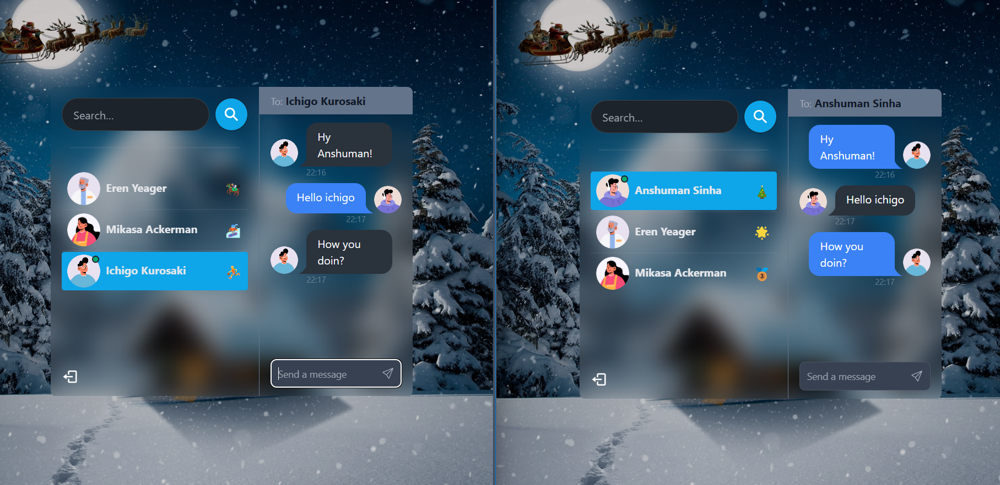

# Awesome Chatting Web Application

🌟 **Tech Stack**: MERN + Socket.io + TailwindCSS + Daisy UI  
🎃 **Authentication & Authorization**: JWT  
👾 **Real-time Messaging**: Socket.io  
🚀 **Online User Status**: Socket.io and React Context  
👌 **Global State Management**: Zustand  
🐞 **Error Handling**: Server-side and Client-side  
⭐ **Deployment**: Like a Pro for FREE!  
⏳ **And Much More!**

---

## Introduction

This project is an awesome chatting web application built using modern technologies such as the MERN stack, Socket.io for real-time messaging, TailwindCSS for styling, Daisy UI for components, and Zustand for global state management. It features authentication and authorization with JWT, real-time messaging, online user status, error handling, and deployment options.

---

## Features

- **Authentication & Authorization**: Secure login and access control using JWT.
- **Real-time Messaging**: Instant messaging functionality powered by Socket.io.
- **Online User Status**: Know who's online in real-time using Socket.io and React Context.
- **Global State Management**: State management made easy with Zustand.
- **Error Handling**: Comprehensive error handling both on the server and client sides.
- **Deployment**: Easily deploy your application with professional-grade strategies for free.

---

## Getting Started

To get started with this project, follow these steps:

1. Clone the repository: `git clone https://github.com/anshumansinha2001/ChatApp.git`
2. Install dependencies: `npm install`
3. Set up environment variables: Refer to `.env.example` for required variables.
4. Start the development server: `npm start`
5. Open your browser and navigate backend server to `http://localhost:5000` to see the app in action.

---

## Acknowledgments

This project was inspired by [burakorkmez](https://github.com/burakorkmez). A special thanks to their YT Channel [ As a Programmer ] for their guidance and tutorials.

---

## Contributing

Contributions are welcome! If you'd like to contribute to this project, feel free to open a pull request or submit an issue.

---

## License

This project is licensed under the [MIT License](LICENSE).

